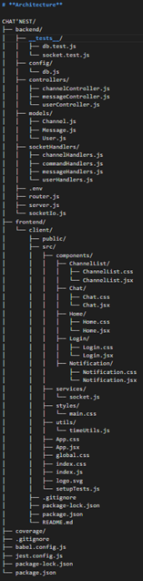

# **Techno :**
- ReactJS
- MongoDB
- Nodejs
- ExpressJS
- JSON
- Socket.io
- Material UI
- Github

# **Détail du Projet**
## **Résumé : **
Le principe de ce projet est de créer site de chatbox. Le site doit avoir un serveur IRC créé avec NodeJS et ExpressJS et un front client en ReactJS.

### **Objectifs finaux du chatbox :**
- Connexion simultanés aux channels
- Notification à la connexion d'un utilisateur
- Création et suppression de channels
- Messagerie dans les channels
- Conservation des messages dans chaque channel
- Messagerie privée

### **Commandes Chat**
- /nick _nickname_ : Modifier son pseudo
- /list : Lister tous les channels disponibles
- /create channel : Créer un channel avec le nom donné
- /delete channel : Supprime le channel avec le nom spécifié
- /join channel : Rejoindre le channel mentionné
- /quit channel : Quitter le channel mentionné
- /users : Lister les utilisateurs présent dans le channel en cours
- /msg _nickname message_ : Enoyer un message privé à l'utilisateur mentionné 
- Bouton _send_ : Envoyer le message ou la commande

# **Architecture**

CHAT'NEST/
├── backend/
│   ├── __tests__/
│   │   ├── db.test.js
│   │   └── socket.test.js
│   ├── config/
│   │   └── db.js
│   ├── controllers/
│   │   ├── channelController.js
│   │   ├── messageController.js
│   │   └── userController.js
│   ├── models/
│   │   ├── Channel.js
│   │   ├── Message.js
│   │   └── User.js
│   ├── socketHandlers/
│   │   ├── channelHandlers.js
│   │   ├── commandHandlers.js
│   │   ├── messageHandlers.js
│   │   └── userHandlers.js
│   ├── .env
│   ├── router.js
│   ├── server.js
│   └── socketIo.js
├── frontend/
│   └── client/
│       ├── public/
│       ├── src/
│       │   ├── components/
│       │   │   ├── ChannelList/
│       │   │   │   ├── ChannelList.css
│       │   │   │   └── ChannelList.jsx
│       │   │   ├── Chat/
│       │   │   │   ├── Chat.css
│       │   │   │   └── Chat.jsx
│       │   │   ├── Home/
│       │   │   │   ├── Home.css
│       │   │   │   └── Home.jsx
│       │   │   ├── Login/
│       │   │   │   ├── Login.css
│       │   │   │   └── Login.jsx
│       │   │   ├── Notification/
│       │   │       ├── Notification.css
│       │   │       └── Notification.jsx
│       │   ├── services/
│       │   │   └── socket.js
│       │   ├── styles/
│       │   │   └── main.css
│       │   ├── utils/
│       │   │   └── timeUtils.js
│       │   ├── App.css
│       │   ├── App.jsx
│       │   ├── global.css
│       │   ├── index.css
│       │   ├── index.js
│       │   ├── logo.svg
│       │   └── setupTests.js
│       ├── .gitignore
│       ├── package-lock.json
│       ├── package.json
│       └── README.md
├── coverage/
├── .gitignore
├── babel.config.js
├── jest.config.js
├── package-lock.json
└── package.json

